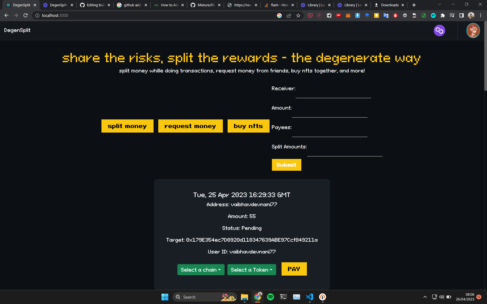
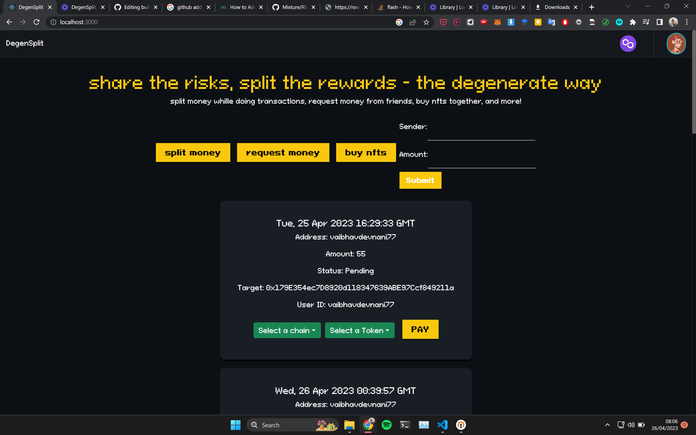
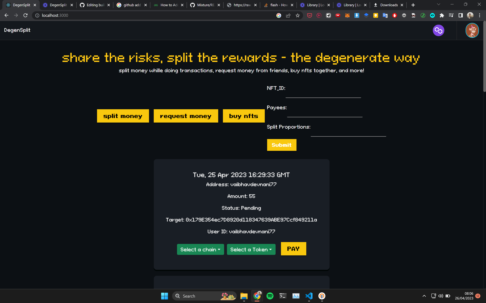

# DegenSplit
## Payments management and NFT Co-ownership platform
https://raw.githubusercontent.com/vaibhavdevnani7/buildweek_pilani/main/degensplit.mp4

Degensplit is a platform where you can split transaction with your friends, request nmoney from friends and co own nfts with your friends. You can do all this with just the usernames of your friends and you can do transactions in any token and on any chain thanks to router protocol making token swaps and cross chain transactions seamless removing all the hassle of swapping tokens, switching chains while making transactions.

This project has 3 features as of now
 

 
1. It is a platform where you can split a transaction between your friends which is done with the help of a smart contract which receives money from all your friends and on receiving from everyone, transfers the final amount to the recipent. You can put usernames of your friends so you dont have to keep track of their wallet ids, making the process simpler. And also because of router protocol's ability to do cross chain and cross asset transactions, everyone can pay in any token with any chain, while the receiver gets the desired amount.
 

 
2. Request money from friends just by using their username, your friends can also send you money on your chaain in your required token by using any token on any chain.
 

 
3. Now you can nfts with your friends by fractionalising them, I am using a smart contract to fractionalize nfts into erc 20 tokens and this way with this platform you can co own a nft with friends.
  

Tech Used
1. Flask and postgres for backend
2. React for frontend
3. Router Protocol for cross chain and cross asset transactions
4. Polygon for making smart contracts and other transactions
5. Spheron for hosting the website
6. Remix ide for developing and deploying smart contracts
7. Avalanche for Polygon test network
8. Metamask as Provider
9. Ethers for web3api
  
Smart Contracts-
 

 
1. For making a split transaction
 

 
2. For fractionalising nfts into er20 tokens and then buying a proportion of all the shares

Folders:
1. Contracts - solidity smart contracts
2. web-server - react frontend
3. web-api - flask+postgres backend
